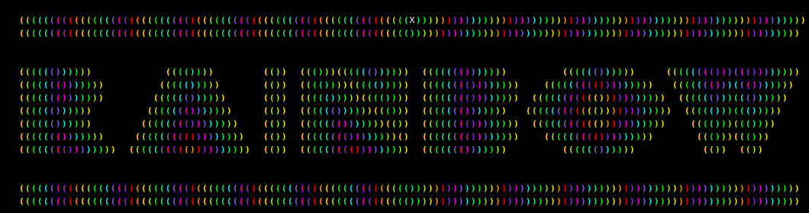
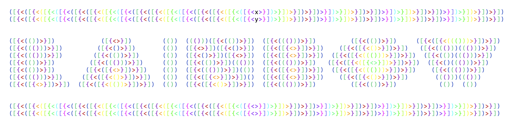
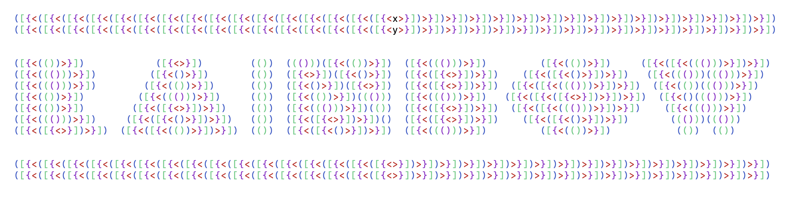
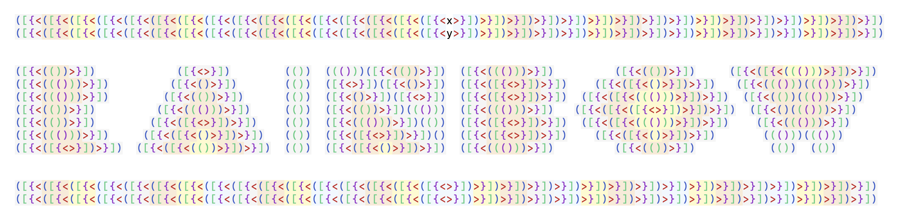
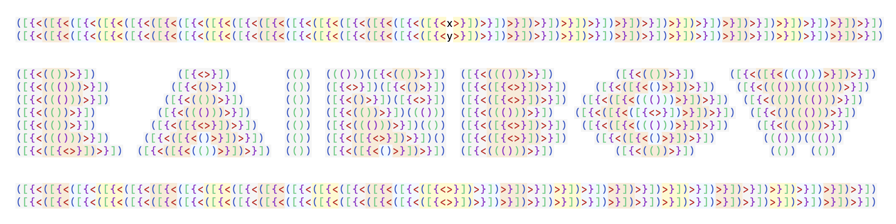

# Summary

This is a simple rainbow colour plug-in for those who want an simple light
weight rainbow colour syntax plug-in that supports `(…)`, `[…]`, `{…}`
and `<…>`. 

If you need something more powerful and configurable try
[Rainbow Parentheses Improved](https://github.com/luochen1990).

This is the original for http://www.vim.org/scripts/script.php?script_id=1561

Based on the original rainbow_parenthesis from john gilmore but enhanced for
gui mode.

|             |                                                                    |
|-------------|--------------------------------------------------------------------|
| Source      | https://github.com/krischik/Rainbow-Parenthesis-Bundle             |
| Releases    | https://github.com/krischik/Rainbow-Parenthesis-Bundle/releases    |
| Wiki        | https://github.com/krischik/Rainbow-Parenthesis-Bundle/wiki        |
| Issues      | https://github.com/krischik/Rainbow-Parenthesis-Bundle/issues      |
| Discussions | https://github.com/krischik/Rainbow-Parenthesis-Bundle/discussions |

# slve improvements

My technique only worked up to 16 level. Which is isn't any good for languages
like lisp. slve fixed this with a recursive solution. Very need.

## before

## after

### dark

### light

# autre improvements

This fork provides for a small fix to the plugin. It also customizes the parentheses colors
for a dark background.

# charlietanksley improvements

Fork of original. Forked primarily to remove the background color on the
syntax highlighting.

# jwilkins improvements

Remove the background color in terminal mode.

# krischik improvements

Fixed all the bugs and merged all the code.
 
Vim got a little stricter on syntax highlights and some of slve tricks didn't
work any more. I also added an option to choose between my colour set and
those of the other contributors.

Increased the levels before repeating back to 16. Slve repeated after 10.

Switched the background colours around for better contrast between level 15
and level 0.

