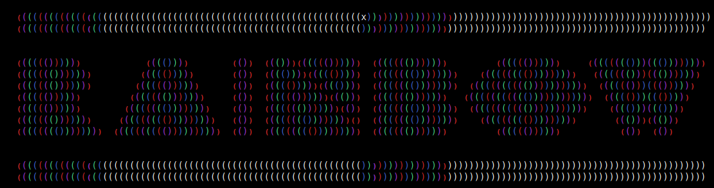

# Summary

This is a simple rainbow colour plug-in for those who want an simple light
weight rainbow colour syntax plug-in that supports `(…)`, `[…]`, `{…}`
and `<…>`. 

If you need something more powerful and configurable try
[Rainbow Parentheses Improved](https://github.com/luochen1990).

This is the original for http://www.vim.org/scripts/script.php?script_id=1561

Based on the original rainbow_parenthsis from john gilmore but enhanced for
gui mode.

Reports errors to: https://github.com/krischik/Rainbow-Parenthesis-Bundle/discussions
Discuss improvements on: https://github.com/krischik/Rainbow-Parenthesis-Bundle/discussions

# slve improvements

My technique only worked up to 15 level. Which is isn't any good for languages
 like lisp. slve fixed this with a recursive solution. Very need.

## before

## after

# krischik improvements

Vim got a little scricter on syntax highlights and some of slve tricks didn't
work any more so fixing was needed. I also added an option to choose between
my colour set and slves

## fixed

